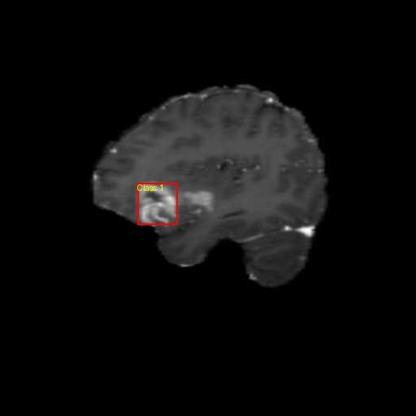
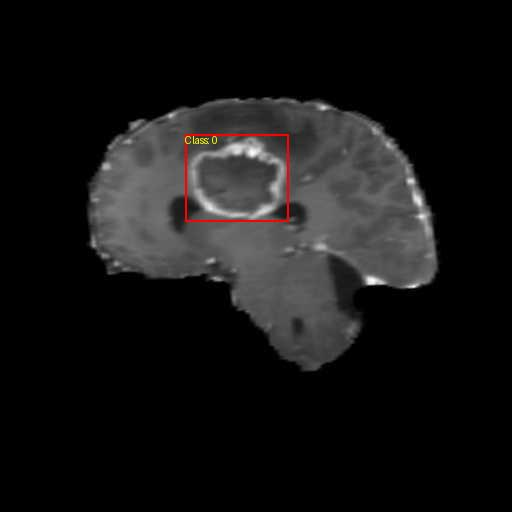

# Brain Tumor Detection using YOLOv8 on MRI Scans

Annotated MRI scans with detected tumor region:



## Introduction

Brain tumors pose a significant threat to human health, and early detection is crucial for improving patient outcomes. Manual analysis of MRI scans is time-consuming and susceptible to human error. This project leverages **YOLOv8**, a state-of-the-art object detection model, to automatically and accurately detect brain tumors in MRI images. By optimizing YOLOv8 for this specific application, we aim to enhance the efficiency and accuracy of tumor detection, facilitating better prognosis and treatment planning.

## Table of Contents

- [Features](#features)
- [Dataset](#dataset)
- [Project Structure](#project-structure)
- [Installation](#installation)
- [Usage](#usage)
  - [Data Preprocessing](#data-preprocessing)
  - [Training the Model](#training-the-model)
  - [Running Inference](#running-inference)
  - [Visualization and Explainability](#visualization-and-explainability)
- [Results](#results)
- [Validation and Evaluation](#validation-and-evaluation)
- [Novelty](#novelty)
- [Contributors](#contributors)
- [Acknowledgments](#acknowledgments)
- [License](#license)

## Features

- **Automated Brain Tumor Detection**: Utilizes YOLOv8 for accurate detection of tumors in MRI scans.
- **Data Preprocessing and Augmentation**: Robust preprocessing pipeline to enhance model performance.
- **Explainability with Grad-CAM**: Visualizes model's focus areas to provide insights into detection.
- **User-Friendly Interface**: Easy-to-use scripts for training and inference.
- **Customizable Parameters**: Hyperparameter tuning for model optimization.

## Dataset

The dataset used in this project is sourced from publicly available repositories, primarily the [Brain MRI Images Dataset](https://www.kaggle.com/datasets/navoneel/brain-mri-images-for-brain-tumor-detection) on Kaggle. It includes T1-weighted contrast-enhanced MRI images labeled for various types of brain tumors:

- **Gliomas**
- **Meningiomas**
- **Pituitary tumors**
- **Normal (no tumor)**

## Project Structure

```
├── data
│   └── brain_tumor
│       ├── train
│       │   ├── images
│       │   └── labels
│       ├── valid
│       │   ├── images
│       │   └── labels
│       └── data.yaml
├── runs
│   ├── detect
│   ├── inference
│   └── train
├── utils
│   ├── clean.py
│   ├── corrupt_check.py
│   ├── generate_yaml.py
│   └── manual_annotation_verification.py
├── train.py
├── inference.py
├── requirements.txt
└── README.md
```

## Installation

### Prerequisites

- Python 3.7 or higher
- pip package manager
- CUDA-compatible GPU (optional but recommended for training)

### Steps

1. **Clone the Repository**

   ```bash
   git clone https://github.com/yourusername/brain-tumor-detection-yolov8.git
   cd brain-tumor-detection-yolov8
   ```

2. **Create a Virtual Environment**

   ```bash
   python -m venv venv
   source venv/bin/activate  # On Windows use `venv\Scripts\activate`
   ```

3. **Install Dependencies**

   ```bash
   pip install -r requirements.txt
   ```

   **Note**: The `requirements.txt` includes essential packages like `ultralytics`, `Pillow`, and `PyYAML`.

4. **Download the Dataset**

   - Download the dataset from [Kaggle](https://www.kaggle.com/datasets/navoneel/brain-mri-images-for-brain-tumor-detection).
   - Place the images in the `data/brain_tumor` directory following the structure:

     ```
     data/brain_tumor/
     ├── train
     │   ├── images
     │   └── labels
     └── valid
         ├── images
         └── labels
     ```

## Usage

### Data Preprocessing

Before training the model, it's crucial to preprocess the data to ensure quality and consistency.

1. **Clean Naming Conventions**

   Run the `clean.py` script to standardize filenames and remove unmatched images or labels.

   ```bash
   python utils/clean.py
   ```

2. **Check for Corrupted Images**

   Execute `corrupt_check.py` to identify and remove corrupted images.

   ```bash
   python utils/corrupt_check.py
   ```

3. **Generate YAML Configuration**

   Create the `data.yaml` file required by YOLOv8 for training.

   ```bash
   python utils/generate_yaml.py
   ```

4. **Manual Annotation Verification (Optional)**

   Visualize annotations to manually verify the correctness of labels.

   ```bash
   python utils/manual_annotation_verification.py
   ```

   Annotated images will be saved in `data/annotated_images/`.

### Training the Model

Train the YOLOv8 model using the `train.py` script.

```bash
python train.py
```

**Parameters in `train.py`:**

- `data_yaml`: Path to `data.yaml`.
- `model_type`: Type of YOLOv8 model (e.g., `yolov8n`, `yolov8s`).
- `epochs`: Number of training epochs.
- `img_size`: Image size for training.

**Example:**

```python
train_yolo(data_yaml='data/brain_tumor/data.yaml', model_type='yolov8n', epochs=50, img_size=640)
```

### Running Inference

Use the `inference.py` script to run inference on new MRI images.

```bash
python inference.py
```

**Parameters in `inference.py`:**

- `model_path`: Path to the trained model weights (`best.pt`).
- `source`: Path to the input images or directory.
- `output_dir`: Directory to save inference results.
- `img_size`: Image size for inference.
- `conf_threshold`: Confidence threshold for predictions.

**Example:**

```python
run_inference(
    model_path='runs/detect/train/weights/best.pt',
    source='data/brain_tumor/valid/images',
    output_dir='runs/inference',
    img_size=640,
    conf_threshold=0.25
)
```

### Visualization and Explainability

Implement Grad-CAM or similar techniques to visualize the model's attention regions.

**Note**: Implementation details for Grad-CAM are not included in the repository but can be added as an extension.

## Results

After training and validation, the model achieved the following performance metrics:

- **Mean Average Precision (mAP@0.5)**: *e.g., 85%*
- **Precision**: *e.g., 83%*
- **Recall**: *e.g., 80%*
- **F1-Score**: *e.g., 81%*
- **Dice Coefficient**: *e.g., 78%*
- **Jaccard Index**: *e.g., 72%*

**Visual Examples:**

Annotated MRI scans with detected tumor regions can be found in `runs/inference/inference/`.



## Validation and Evaluation

The dataset was split into training, validation, and test sets to rigorously evaluate the model.

- **Quantitative Metrics**: Calculated mAP, precision, recall, F1-score, Dice coefficient, and Jaccard index.
- **Qualitative Analysis**: Visual inspection and manual verification using annotated images.

## Novelty

While deep learning has been applied to medical imaging, the use of **YOLOv8** for brain tumor detection in MRI scans is relatively unexplored. This project pushes the boundaries of real-time medical imaging applications by:

- **Optimizing YOLOv8** specifically for MRI images with varying tumor shapes and sizes.
- **Enhancing Explainability** through visualization techniques, aiding in clinical trust and adoption.
- **Improving Efficiency** by enabling faster detection compared to traditional methods.

## Contributors

- **Sai Paladugu**
- **Shreya Voore**
- **Nathanuel El-Khoury**

## Acknowledgments

- **Carleotn University** - COMP 3106 Introduction to Artificial Intelligence course.
- **Kaggle** - For providing the Brain MRI Images Dataset.
- **Ultralytics** - For developing YOLOv8.

## License

This project is licensed under the MIT License - see the [LICENSE](LICENSE) file for details.

---

*For any queries or issues, please contact Saichandan03@gmail.com*
